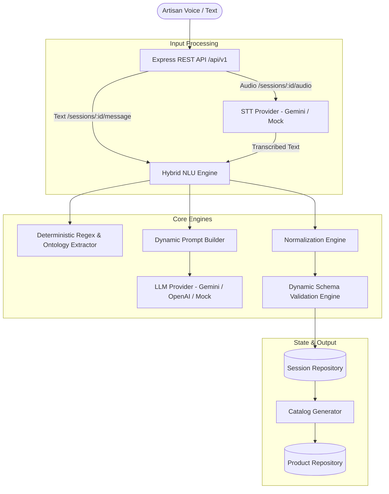

# Multilingual Conversational NLU Engine

[](https://www.typescriptlang.org/)
[](https://nodejs.org/)
[](https://vitest.dev/)
[](https://swagger.io/)

> **Smart India Hackathon (SIH 2026) — Problem Statement 26090**  
> Standalone, modular, 100% configuration-driven Multilingual Conversational NLU Engine built completely in **TypeScript/Node.js**.

---

## 🌟 Overview

The **Multilingual Conversational NLU Engine** converts unstructured voice or text communications from traditional Indian artisans into validated, structured e-commerce product catalogs.

- **100% Configuration-Driven**: Zero hardcoded craft names, languages, intent keywords, or validation rules. Adding a new craft requires only adding a JSON schema and ontology file.
- **Multilingual Support**: Telugu, Hindi, Tamil, Kannada, Bengali, Marathi, Gujarati, English, and more.
- **Hybrid NLU Engine**: Combines low-latency deterministic entity extraction (regex, craft ontologies, multilingual numeric/currency words) with LLM structured reasoning.
- **Ephemeral Voice Pipeline**: Uploaded artisan voice audio is transcribed in memory via STT and discarded immediately. Audio is never stored permanently.
- **Auto-Generated E-Commerce Catalogs**: Automatically creates titles, descriptions, SEO keywords, and tags directly from validated attributes.

---

## 🏗️ Architecture



---

## 🚀 Quick Start

### 1. Prerequisites
- **Node.js**: v20+ (tested on Node v24)
- **npm**: v10+

### 2. Installation
```bash
git clone <repository_url>
cd "Multilingual Conversational NLP Engine"
npm install
```

### 3. Environment Configuration
```bash
cp .env.example .env
```
Default `.env` configuration runs smoothly out-of-the-box using the built-in development `mock` providers and in-memory repositories.

To use live LLM / STT providers:
```env
LLM_PROVIDER=gemini
GEMINI_API_KEY=your_gemini_api_key_here
STT_PROVIDER=gemini
```

### 4. Running the Application
```bash
# Development mode (auto-reload via tsx)
npm run dev

# Build for production
npm run build

# Start production build
npm run start
```

### 5. Running Tests
```bash
# Run Vitest test suite
npm test
```

---

## 📡 API Reference

Interactive Swagger UI documentation is available at:  
`GET http://localhost:3000/api/v1/docs`

| Method | Endpoint | Description |
|---|---|---|
| `GET` | `/api/v1/health` | System health, database connection, and provider status |
| `POST` | `/api/v1/sessions` | Create a new artisan conversational session |
| `GET` | `/api/v1/sessions/:id` | Fetch session state, product draft, and message history |
| `POST` | `/api/v1/sessions/:id/message` | Submit multilingual natural text utterance |
| `POST` | `/api/v1/sessions/:id/audio` | Upload artisan voice audio (`multipart/form-data`) |
| `POST` | `/api/v1/products/validate` | Validate craft draft attributes against dynamic schema |
| `POST` | `/api/v1/products/catalog` | Generate e-commerce catalog title, descriptions & tags |
| `POST` | `/api/v1/products/publish` | Finalize session, build catalog, and save product |

---

## 🔄 Grounded NLU Pipeline

```text
Input (Voice / Text)
  ↓
STT (for voice — ephemeral in-memory processing)
  ↓
Language / script detection
  ↓
Deterministic extraction (regex + craft ontologies + numerals)
  ↓
LLM semantic understanding (strictly structured output)
  ↓
Grounded entity resolution & anti-hallucination filtering
  ↓
Conversation state tracking & natural corrections
  ↓
Validation against active dynamic schema
  ↓
Missing-field question generation
  ↓
Validated product draft
  ↓
Catalog generation (grounded strictly in validated facts)
  ↓
Publish API
```

---

## 🔒 Privacy & User Isolation

- **Server-Side Identity**: Authenticated identity is resolved on the server via `authMiddleware` (`Authorization: Bearer <token>` or `X-User-Id`), preventing client spoofing.
- **Strict Session & Product Isolation**: Artisans cannot read, modify, or publish products belonging to other users (`403 Forbidden`).
- **Prompt Isolation**: Prompts sent to external LLMs contain only current-session context and active schema definitions. Never whole databases, credentials, or unrelated user data.
- **Ephemeral Audio**: Voice audio buffers are processed purely in-memory, transcribed, zeroed out immediately after processing, and never saved to disk.
- **PII Protection**: Personal identifiable information (phone numbers, addresses) is strictly excluded from public e-commerce catalogs.
- **Logging Hygiene**: Secrets, tokens, passwords, and raw audio payloads are never written to logs.

---

## 🛡️ Grounded / Hallucination-Resistant Architecture

1. **Precedence Hierarchy**:
   `Explicit User Evidence > Deterministic / Ontology Extraction > LLM Semantic Extraction > Inference`
2. **Schema Whitelisting**: Any attribute returned by an LLM that is not defined in the active `DynamicSchema` is strictly discarded.
3. **Prompt Guardrails**: Both NLU and Catalog LLM prompts strictly forbid inventing artisan lineage, awards, certifications, dimensions, GI status, delivery times, or prices.
4. **Validation Verification**: Every product draft is validated through `ValidationEngine` before publishing.

---

## 🛠️ Configuration & Extensibility

- **Add New Craft Schemas**: Place new JSON schemas under `src/schemas/` adhering to the `DynamicSchemaDefinition` specification.
- **Add Craft Ontologies**: Extend `src/ontology/craftOntology.json` with localized aliases and raw materials.
- **Add Dialogue Intents**: Extend `src/core/dialogue/intents.json`.
- **Add LLM / STT Providers**: Implement `ILLMProvider` in `src/providers/llm/` or `ISTTProvider` in `src/providers/stt/` and register in the corresponding factory.

---

## 📄 License
ISC
